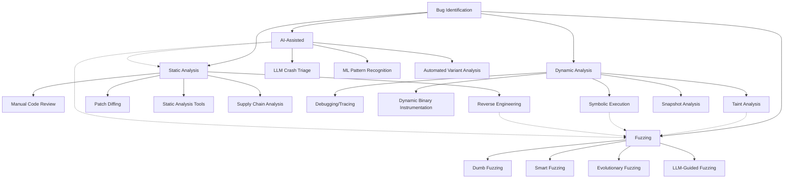

## Full Methodology

# Bug Identification

## Overview

Bug identification is the process of discovering potential vulnerabilities in software through various techniques including static analysis, dynamic analysis, and fuzzing. This document outlines methodologies and tools for effective vulnerability research.

For practical exploit development, see [Exploit Development](/exploit/development.md).

## Vulnerability Research Methodology

### Phase 1: Reconnaissance

- **Target Enumeration:** Identify version, dependencies, configuration
- **Attack Surface Mapping:** List all input vectors, APIs, protocols
- **Documentation Review:** RFCs, specifications, developer docs
- **Prior Art Analysis:** CVE database, exploit-db, bug trackers

### Phase 2: Static Analysis

- **Source Review:** If available, focus on parsing/validation code
- **Binary Analysis:** Reverse engineering with Ghidra/IDA
- **Patch Diffing:** Compare vulnerable vs patched versions
- **SBOM Analysis:** Check third-party component vulnerabilities

### Phase 3: Dynamic Analysis

- **Behavioral Analysis:** Monitor syscalls, network, file I/O
- **Debugging:** Trace execution paths with controlled input
- **Instrumentation:** Coverage-guided exploration
- **Taint Analysis:** Track input propagation

### Phase 4: Fuzzing

- **Corpus Generation:** Create valid seed inputs
- **Harness Development:** Isolate target functionality
- **Coverage Monitoring:** Identify untested code paths
- **Crash Triage:** Classify and prioritize findings

### Phase 5: Exploitation

- **Primitive Development:** Convert bug to reliable primitives
- **Mitigation Bypass:** Defeat ASLR, DEP, CFG, etc.
- **Payload Development:** Create working exploit
- **Weaponization:** Package for real-world use (if authorized)

## Attack Surface Identification

Before diving into specific bug hunting techniques, it's essential to understand where to look for vulnerabilities.

### Windows User Mode

- Shared Memory
- RPC
- Named Pipes
- File & Network IO
- Windows Messages
- For authentication-related vulnerabilities, see [Windows Auth](/exploit/windows-auth.md)

### Kernel

- _Device Drivers_
  - Many third-party software with drivers to target
  - Can accept arbitrary user input via the `IOCTL` interface
  - Also performs actions when we `open,close` handles to it
- _OS_
  - Drivers that handle hardware and user input
  - Intercepts/transitions from user to kernel
- _Modern Linux interfaces (hotspots)_
  - **io_uring**: SQE size/offset confusions, submission/completion race windows, kernel copy‑sizes derived from user buffers
  - **userfaultfd**: cross‑thread write‑what‑where and TOCTOU primitives during fault handling
  - **seccomp user‑notifier**: confused‑deputy patterns in broker processes; notifier time‑of‑check vs time‑of‑use gaps
- _Hyper-V & VTL Interfaces_ – On many modern Windows 11 systems (especially 24H2 on supported hardware), Virtualization‑Based Security and VTL1 are enabled or easily enabled by policy. Treat the hypervisor surface (e.g., `hvix64.exe` and synthetic MSRs) as a common kernel target, and verify VBS/HVCI status on the host before assuming defaults.

### Drivers

- _DriverEntry_: registers for any callbacks, setup structure, etc
- _I/O Handlers_: handlers that get called when a process attempts to `open,close,etc` the driver, `IOCTL` allows driver functionality to be called from user processes
- Practical triage example (CVE‑2025‑8061):
  - IOCTL handlers that accept a fixed‑size struct and pass a user‑controlled `PHYSICAL_ADDRESS` directly to `MmMapIoSpace`
  - then memcpy out/in mapped memory (sometimes via wrappers that swap src/dst) indicate physical memory read/write primitives.
  - Similarly, unguarded MSR read/write paths yield `RDMSR/WRMSR` primitives.
- See the Lenovo `LnvMSRIO.sys` case study in [windows-kernel.md](/exploit/windows-kernel.md)

### eBPF & XDP

- **BPF helpers and verifier**: pointer leaks, verifier bypass, JIT bugs
- **User‑entry vectors**: `bpf()` syscall, privileged pods in Kubernetes, Cilium datapath
- **Tooling**: `bpftool`, verifier logs, `bpftrace` scripts for quick triage
- **CO‑RE skeletons** (`bpftool gen skeleton`) simplify packaging portable tracing probes.
- **BPF LSM** hooks allow low‑overhead coverage feedback on security‑critical kernel paths; export events with `trace_pipe`.

### Container & Micro‑VM Surface

- Namespace/cgroup escapes, device‑mapper abuse, races in snapshotting backends (e.g., overlayfs)
- Micro‑VM hypercalls in Firecracker, CloudHypervisor, Kata Containers
- For detailed container exploitation techniques, see [Container](/exploit/container.md)

### Cloud‑Native & IAM Bugs

- Misconfigured IAM policies, privilege‑escalating API actions (AWS `sts:AssumeRole`, Azure Golden SAML)
- SSRF paths into metadata services (`169.254.169.254`, IMDSv2 bypass techniques)
- Race conditions in managed control‑plane components (Kubernetes API server, AWS Lambda workers)
- Kubernetes Attack Vectors: look at [kubernetes](/pentest/kubernetes.md) for a deeper checklist
- **Serverless Vulnerabilities:**
  - Lambda layer poisoning
  - Function URL authentication bypass
  - Event injection through SQS/SNS/EventBridge
  - Cold start race conditions

### Network / Transport Protocol Parsers

- **QUIC / HTTP/3**: coalesced frames, reorder/timing corner cases; verify against RFC 9000 (QUIC) and RFC 9114 (HTTP/3)
- **HTTP/2**: stream state machine desync; flow‑control integer edge cases (RFC 7540)
- **gRPC / Protobuf**: length truncation across language FFI, map/list coercion; see gRPC framing and protobuf varint rules
- **GraphQL**: input coercion and resolver recursion limits; check GraphQL spec for type coercion semantics

### WebAssembly Runtimes

- WASM JIT optimization bugs in V8, Wasmtime, Wasmer
- WASI sandbox escapes through host‑call interfaces
- Typed‑Func‑Refs, GC, Tail‑calls, Memory64 expand type/bounds confusion surface. See the WebAssembly proposals status page for current rollout and engine adoption.
- **Checklist**:
  - validate table element types/import signatures/hostcall marshalling
  - fuzz mixed 32/64-bit memories.
  - _Fuzzing tip_: compile native libs to WASM for fast, deterministic mutation cycles

### Browser / JS Engine Exploitation

#### Modern V8 Architecture (2024-2025)

V8 now uses a multi-tier JIT pipeline with distinct exploitation characteristics:

- **Ignition (Interpreter):** Bytecode interpreter; rarely targeted directly
- **Maglev (Mid-tier JIT):** Introduced Chrome 115+; simpler IR than TurboFan
- **TurboFan (Optimizing JIT):** Aggressive optimization; traditional exploitation target
- **Turboshaft:** New IR replacing TurboFan internals; different optimization patterns create new bug classes
  - Type lattice changes affecting confusion bugs
  - Maglev → Turboshaft transition paths expose state inconsistencies
  - Node-based to block-based IR transition

#### V8 Maglev Exploitation

- Integer overflow in Maglev's fast-path arithmetic
- Corrupted HeapNumber backing store via Maglev bounds check bypass
- Map/ElementsKind confusion in polymorphic inline caches

#### WebAssembly JSPI (JavaScript Promise Integration)

- **Stack Heap Spray:** Suspended WASM stacks allocated on heap; predictable layout
- **Type Confusion:** `WebAssembly.Suspending` wrapper type mismatch
- **Info Leak:** Stack pointers exposed through Promise resolution chains
- **Sandbox Escape:** JSPI bridges JS/WASM boundary; bypass traditional WASM isolation

#### Spectre-BHB Browser Mitigations

- **Chrome 120+:** Site Isolation per-frame; shared array buffer restrictions
- **Firefox 122+:** Process-per-site with BHI fences in JIT trampolines
- **Safari 17.4+:** WebKit JIT speculation guards on type checks

#### Site Isolation Plus

- **Frame-level process isolation:** Each cross-origin frame in separate process
- **Cross-origin memory protection:** Hardware-backed memory isolation
- **New IPC attack surface:** Mojo interface exploitation required for escapes
- **Renderer → Browser requirements:** Need Mojo race or type confusion
- New Info-Leak Requirements:
  - Traditional `SharedArrayBuffer + Atomics` timing attacks less reliable
  - Need alternative side-channels: CSS timing, WebGL shader execution, AudioContext
  - Cross-origin info leaks require chaining multiple primitives

#### Practical Browser Exploitation Workflow

1. **Target Selection:**
   - V8 Maglev for Chrome/Edge (faster development cycle = more bugs)
   - JSC for Safari (less scrutiny than V8)
   - SpiderMonkey for Firefox (IonMonkey/Warp still viable)

2. **Primitive Development:**
   - `addrof`: Leak object addresses (info leak)
   - `fakeobj`: Craft fake object (type confusion)
   - `arbread/arbwrite`: Arbitrary memory access
   - `shellcode`: RWX page or WASM JIT abuse

3. **Sandbox Escape:**
   - Mojo IPC race conditions
   - GPU process exploitation via WebGL
   - Utility process TOCTOU (Chrome's new architecture)

4. **Post-Exploitation:**
   - Chrome: Target browser process via Mojo
   - Safari: XPC service exploitation for sandbox escape
   - Firefox: Target parent process via IPC

### Firmware & Embedded

- UEFI DXE driver flaws, BMC web console auth bypass, ECU/CAN message injection
- BLE & Zigbee stack overflows, heap exploits in `btstack`, `lwIP`

### macOS / Apple‑Silicon Kernel

- IOKit user‑client input validation, IOMFB allocator corner‑cases
- Hypervisor.framework fuzzing with `hv_fuzz`

### Mobile Platforms (iOS/Android)

#### iOS 17+ Exploitation

- **PAC Bypass:** Pointer Authentication Code bypass via signing gadgets
- **PPL Bypass:** Page Protection Layer exploitation for kernel r/w
- **Secure Enclave:** SEP exploitation via malformed Mach messages
- **Neural Engine:** ANE kernel driver attack surface

#### Android 14+ Exploitation

- **MTE (Memory Tagging):** Probabilistic bypass with tag collisions
- **GKI (Generic Kernel Image):** Vendor hooks as attack surface
- **Scudo Hardening:** Heap exploitation with hardened allocator
- **Hardware Attestation:** Keymaster/StrongBox TEE attacks

#### Cross-Platform Mobile

- **Flutter:** Dart VM type confusion, FFI boundary issues
- **React Native:** JavaScript bridge serialization bugs
- **Unity:** IL2CPP memory corruption, native plugin vulnerabilities

