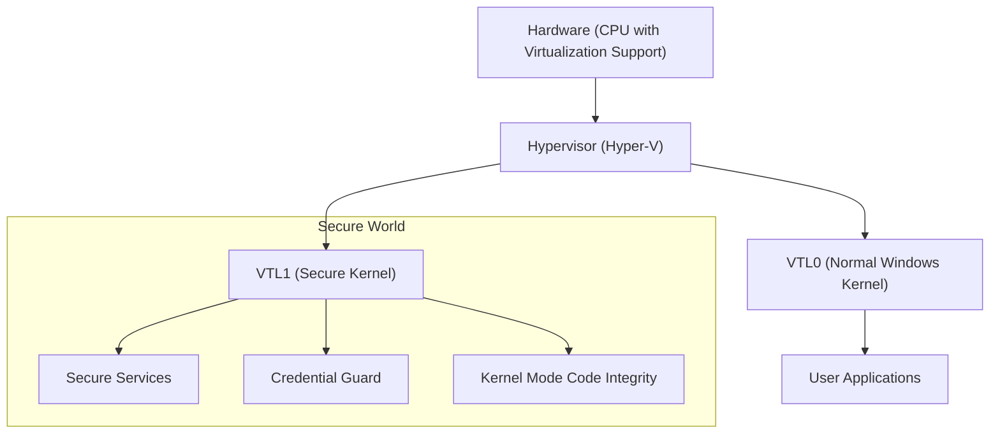
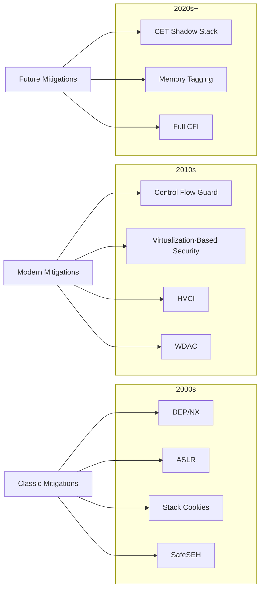

# Extended reference (split from SKILL.md for context economy)

## File System and Data Protections

### Filesystem Protections (fs-verity & fscrypt)

- Linux:
  - fs-verity: Provides integrity protection for read-only files.
  - fscrypt: Enables filesystem-level encryption for data at rest.

### BitLocker Drive Encryption

- Windows:
  - Full disk encryption to protect data at rest.
  - Uses TPM and user credentials for encryption keys.

### Integrity Measurement Architecture (IMA) / Extended Verification Module (EVM)

- Linux:
  - Provides runtime integrity checking for files and metadata based on stored hashes.
  - Ensures files haven't been tampered with post-boot.

## Access Control and Attack Surface Reduction

### Strict Syscall Filtering (Seccomp)

- Linux:
  - Allows applications to restrict system calls they can invoke.
  - Reduces the kernel's attack surface from user-space applications.
- Seccomp user‑notifier:
  - Enables broker‑style decisions in userspace; defend against confused‑deputy by strict validation and time‑bounded decisions
  - Attackers may abuse notifier latency for TOCTOU races; keep policies minimal and deterministic

#### Practitioner

- Inspect running process seccomp: `grep Seccomp /proc/<pid>/status` (0=disabled, 1=strict, 2=filter).
- Use `seccomp-tools dump <pid>` to view filters; in containers, inspect OCI seccomp profile.

### Container Security Mitigations

- **User Namespaces**:
  - Isolates user and group IDs between host and container.
  - Provides privilege isolation without requiring root on the host.
  - Maps container root (UID 0) to unprivileged user on host.

- **PID Namespaces**:
  - Isolates process IDs, preventing container processes from seeing host processes.
  - Container init process becomes PID 1 within its namespace.

- **Network Namespaces**:
  - Provides isolated network stack (interfaces, routing tables, firewall rules).
  - Prevents network-based container escape attacks.

- **Mount Namespaces**:
  - Isolates filesystem view, preventing access to host filesystem.
  - Combined with chroot-like restrictions and read-only mounts.

- **Capability Dropping**:
  - Removes dangerous Linux capabilities from container processes.
  - Examples: `CAP_SYS_ADMIN`, `CAP_NET_ADMIN`, `CAP_SYS_MODULE`.

- **Seccomp Profiles**:
  - Restricts system calls available to containerized processes.
  - Default Docker/Podman profiles block ~44 dangerous syscalls.

- **AppArmor/SELinux Profiles**:
  - Mandatory Access Control for container processes.
  - Restricts file access, network operations, and capabilities.

#### Container hardening quick test

```bash
docker inspect <ctr> | jq '.[0].HostConfig.SecurityOpt, .[0].HostConfig.CapDrop'
capsh --print
lsns | grep " $(cat /proc/self/ns/pid) \|net\|mnt\|user\|ipc\|uts"
grep Seccomp /proc/$$/status
id -Z 2>/dev/null || echo "No SELinux context"
```

#### Bypass Techniques

- **Namespace Escapes**: Exploiting kernel bugs in namespace implementations.
- **Capability Abuse**: Leveraging remaining capabilities (e.g., `CAP_DAC_OVERRIDE`) for privilege escalation.
- **Seccomp Bypasses**: Finding allowed syscalls that can be chained for exploitation.
- **Container Runtime Exploits**: Targeting Docker/containerd/runc vulnerabilities.
- **Host Resource Access**: Exploiting mounted host resources (sockets, devices, filesystems).
- **Privileged Containers**: Targeting containers running with `--privileged` flag.

#### Practitioner

- Check container mitigations: `docker inspect <container>` or `podman inspect <container>`
- Audit capabilities: `capsh --print` inside container
- List namespaces: `lsns` or `ls -la /proc/$$/ns/`
- Seccomp status: `grep Seccomp /proc/$$/status`
- SELinux context: `id -Z` (if SELinux enabled)
- **Container security scanning**: Tools like `docker-bench-security`, `kube-bench`

### Lockdown Mode

- Linux:
  - Restricts access to kernel features that could allow code execution.
  - Enhances security, especially with Secure Boot enabled.
  - **Linux 6.14** extends lockdown to cover kexec‑file pinning and loads the built‑in module blocklists earlier, further closing BYOVD avenues.

### Executable‑policy Securebits

- **Linux 6.14:** Introduces `SECBIT_EXEC_RESTRICT_FILE` and `SECBIT_EXEC_DENY_INTERACTIVE` securebits together with the `AT_EXECVE_CHECK` flag, allowing interpreters to delegate final execution‑permission checks to the kernel and tightening script/loader abuse paths.

### NTSYNC Driver Hardening

- **Linux 6.14:** The new `ntsync` driver offers an `io_uring`‑based fast‑path that removes classic futex primitives from reachable attack surface, reducing user→kernel synchronization abuse.

### Landlock LSM

- Linux:
  - Unprivileged sandboxing framework allowing processes to restrict their own access rights.
  - Reduces the impact of compromised user-space applications.

### AppContainer and User Account Control (UAC)

- Windows:
  - AppContainer: Application isolation for modern apps.
  - UAC: Limits application privileges, prompting for elevation when necessary.

### PatchGuard (KPP)

- Windows:
  - Protects the kernel from modifications of critical structures and registers.
  - Periodically checks for unauthorized modifications to kernel structures.
  - Asynchronously monitors critical structures: IDT, GDT, SSDT, MSRs, kernel stacks
  - Triggers `CRITICAL_STRUCTURE_CORRUPTION` BSOD (0x109) when tampering detected
  - **Modern impact**: Blocks classic SSDT/IDT hooking on Windows 10/11

#### Bypass Techniques

- **Bootkit Deployment**: Bypassing protection at boot time before PatchGuard initializes.
- **Debugging Bypass**: PatchGuard doesn't run if a debugger is attached at boot.
- **Timing Attacks**: Taking advantage of the periodic nature of PatchGuard checks.
- **Memory Manipulation**: Modifying kernel memory without triggering detection mechanisms.
- **Hypervisor-based**: Type 1 hypervisor using EPT to hide kernel modifications

### Windows Sandbox

- Windows:
  - Provides a disposable virtual environment.
  - Runs untrusted software isolated from the host system.

### Module Signing Enforcement

- Linux/Windows:
  - Code signing for kernel modules
  - Prevents loading of unsigned or maliciously modified kernel components

### Block Remote Images

- Windows:
  - Prevents loading DLLs from UNC file paths (e.g., \\\\evilsite\\bad.dll).
  - Blocks attackers from bypassing ASLR by loading non-rebased modules.

### Block Untrusted Fonts

- Windows:
  - Only loads fonts from trusted locations.
  - Prevents attacks like Stuxnet that exploit font rendering vulnerabilities in kernel mode.

### Validate Handle Usage

- Windows:
  - Checks handle references to ensure they are valid.
  - Prevents exploitation of handle misuse.

### Disable Extension Points

- Windows:
  - Blocks registry-based extension points like AppInit_DLL.
  - Prevents hooking or extending applications through known extension mechanisms.

### Disable Win32k System Calls

- Windows:
  - Disables unused system calls to reduce attack surface.
  - Particularly effective against kernel exploits.

### Do Not Allow Child Processes

- Windows:
  - Blocks the ability for a process to call the CreateProcess function.
  - Prevents malware from spawning additional processes (also known as "Calc Killer").

### Validate Image Dependency

- Windows:
  - Requires any DLL loaded by a process to be signed by Microsoft.
  - Prevents DLL side-loading attacks.

### Block Low Integrity Images

- Windows:
  - Blocks processes running at low or untrusted integrity levels from loading downloaded files.
  - Enhances sandbox security.

### Usermode Helper (UMH) Mitigations

- Linux:
  - CONFIG_STATIC_USERMODEHELPER: Forces all usermode helper calls through a static binary.
  - CONFIG_STATIC_USERMODEHELPER_PATH: Sets the path to the static usermode helper binary.
  - Prevents attackers from abusing kernel-to-userspace execution paths.
  - Requires userspace support.

### SMB Signing

- Windows:
  - Adds cryptographic signatures to Server Message Block (SMB) packets.
  - Prevents man-in-the-middle attacks against network file sharing.

## Hardware-Assisted Security Features

### Trusted Platform Module (TPM) 2.0

- Windows/Linux:
  - Secure crypto-processor enhancing hardware security.
  - Used for secure boot, disk encryption, and credentials.

### Secure Boot

- Windows/Linux:
  - Ensures only trusted, signed software loads during boot.
  - Prevents boot-level malware from starting before the OS.

### UEFI Firmware Security

- Windows/Linux:
  - Provides a secure pre-OS environment.
  - Supports Secure Boot and firmware integrity checking.

## Diagrams

### Modern Security Architecture

```mermaid
flowchart TB
    System["System Security"]

    subgraph "Memory Protection"
        KASLR["Kernel ASLR"]
        KPTI["Kernel Page Table Isolation"]
        SMAP["Supervisor Mode Access Prevention"]
        SMEP["Supervisor Mode Execution Prevention"]
        KDP["Kernel Data Protection"]
        RODATA["Read-Only Data Sections"]
    end

    subgraph "Virtualization Security"
        VBS["Virtualization-Based Security"]
        HVCI["Hypervisor-Enforced Code Integrity"]
        MBEC["Mode-Based Execution Control"]
        KMCI["Kernel Mode Code Integrity"]
    end

    subgraph "Control Flow Protection"
        CFG["Control Flow Guard"]
        CET["Control-Flow Enforcement Technology"]
        KCFG["Kernel Control Flow Guard"]
    end

    System --> KASLR
    System --> KPTI
    System --> SMAP
    System --> SMEP
    System --> KDP
    System --> RODATA
    System --> VBS
    System --> HVCI
    System --> MBEC
    System --> KMCI
    System --> CFG
    System --> CET
    System --> KCFG
```



### Virtualization-Based Security Stack



### Exploit Mitigation Evolution



---

## Attribution

Ported from [SnailSploit/Claude-Red](https://github.com/SnailSploit/Claude-Red)
(`Skills/*/offensive-mitigations`), Apache-2.0 licensed. Methodology preserved; Claude-specific
mechanics rewritten for OSA's builtin tools.

Part of the offensive skill library — see also `penetration-testing` for the
full-engagement workflow and `offensive-osint` / `osint-methodology` for
reconnaissance methodology.

## Tool status note

External CLI tools referenced above are classified at authoring time as `[LOCAL]`
(verified present), `[INSTALL]` (one-command install), or `[UPSTREAM-REF]`
(needs API keys or interactive use — methodology reference only). If you invoke a
tool and it is absent, check for an `[INSTALL]` note or fall back to the OSA
builtin tools; never fabricate tool output.
