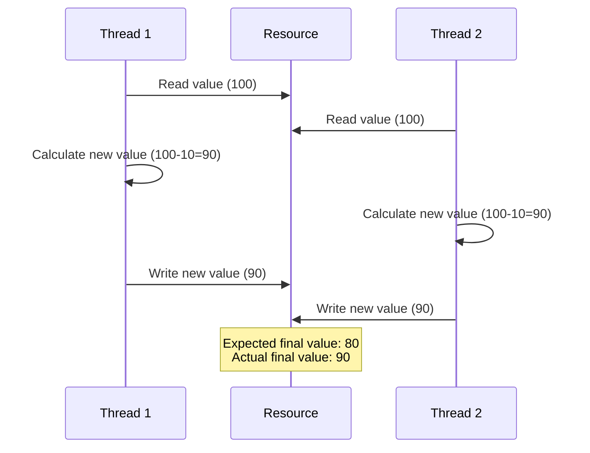
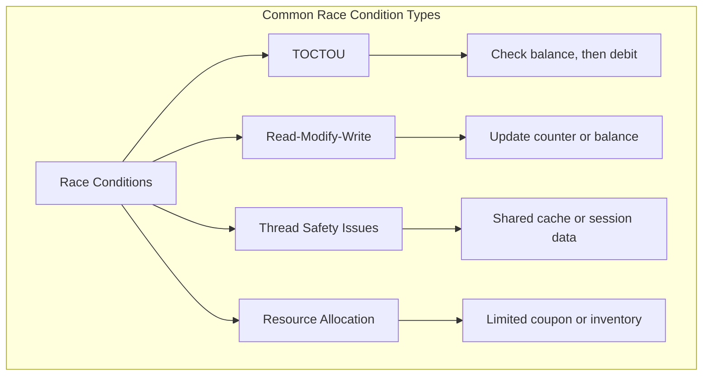
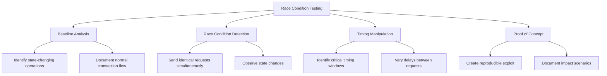
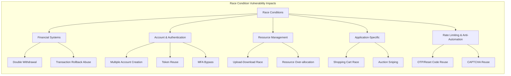

## Full Methodology

# Race Conditions

## Shortcut

- Spot the features prone to race conditions in the target application and copy the corresponding requests.
- Send multiple of these critical requests to the server simultaneously. You should craft requests that should be allowed once but not allowed multiple times.
- Check the results to see if your attack has succeeded. And try to execute the attack multiple times to maximize the chance of success.
- Consider the impact of the race condition you just found.

## Mechanisms

Race conditions occur when the behavior of a system depends on the relative timing or sequence of events that can happen in different orders. In web application security, race conditions happen when multiple concurrent processes or threads access and manipulate the same resource simultaneously without proper synchronization.



A race condition becomes a security vulnerability when it affects security controls or business logic. The critical types include:

- Time-of-Check to Time-of-Use (TOCTOU): When a check is performed, but circumstances change before the result of the check is used
- Read-Modify-Write: When multiple processes read, modify, and write back a shared resource without coordination
- Thread Safety Issues: When multithreaded applications improperly handle shared resources
- Resource Allocation Races: Competition for limited resources like database connections or memory



Common vulnerable scenarios include:

- Account Balance Manipulation: Making multiple withdrawals/transfers simultaneously
- Coupon/Promotion Code Reuse: Using a single-use code multiple times
- File Upload Processing: Uploading and accessing temporary files before validation completes
- Registration Processes: Creating multiple accounts with the same unique identifier
- Token Verification: Using authentication tokens multiple times before they're invalidated

## Hunt

### Identifying Race Condition Vulnerabilities

#### Target Functionality Selection

Focus on features handling state changes, limited resources, or critical operations:

- Financial Transactions: Fund transfers, withdrawals, purchases
- Inventory Systems: Stock allocation, reservation systems
- Coupon/Points Systems: Redeeming coupons, points, or rewards
- Voting/Rating Systems: Likes, upvotes, downvotes, polls
- Membership/Subscription Actions: Inviting users, joining/leaving groups, following/unfollowing users
- Registration Systems: Account creation with unique attributes
- Resource Management: Uploading, processing, or accessing resources
- Rate-Limited Actions: Password resets, login attempts, API endpoints with usage limits

#### Testing Prerequisites

1. Tools for sending parallel requests:
   - Burp Suite Turbo Intruder or Repeater (multi-threaded)
   - Custom scripts with threading capabilities
   - Race condition testing frameworks (e.g., Racepwn)

2. Request capturing and analysis capabilities:
   - HTTP proxy for intercepting and modifying traffic
   - Response analysis tools for detecting race-related anomalies

3. Network Proximity: Consider the physical or network location of your testing infrastructure relative to the target server. Minimizing latency (e.g., using a VPS in the same region/provider as the target) can significantly increase the chances of winning a race condition.

#### Testing Methodology



1. Baseline Behavior Analysis:
   - Identify state-changing operations
   - Understand normal request/response patterns
   - Document application's standard transaction flow

2. Race Condition Detection:
   - Send identical requests simultaneously (10-100 threads)
   - Observe effects on application state
   - Look for anomalies in responses or state changes

3. Timing Manipulation:
   - Identify critical timing windows
   - Target synchronization points
   - Test with varying delays between requests

### Advanced Testing Techniques

#### API-Based Race Condition Testing

1. Identify stateful API endpoints
2. Create automated scripts for parallel API requests:

```python
import requests
import threading

def make_request():
    requests.post('https://target.com/api/redeem',
                  json={'coupon_code': 'ONCE123'},
                  headers={'Authorization': 'Bearer token'})

threads = []
for _ in range(20):
    t = threading.Thread(target=make_request)
    threads.append(t)
    t.start()

for t in threads:
    t.join()
```

#### Transaction-Based Race Condition Testing

1. Identify multi-step transactions
2. Find the critical state change requests
3. Execute the final step in parallel before state updates propagate:
   ```
   Step 1: Start purchase (single request)
   Step 2: Apply coupon (single request)
   Step 3: Send 20 simultaneous "confirm order" requests
   ```

#### Thread Synchronization Testing

Create coordinated attacks that target specific timing windows:

```python
import requests
import threading
import time

start_gate = threading.Event()

def synchronized_request():
    start_gate.wait()  # All threads wait here until flag is set
    requests.post('https://target.com/api/withdraw',
                  json={'amount': '100'},
                  headers={'Authorization': 'Bearer token'})

threads = []
for _ in range(50):
    t = threading.Thread(target=synchronized_request)
    t.daemon = True
    threads.append(t)
    t.start()

# Release all threads simultaneously
time.sleep(2)  # Ensure all threads are waiting
start_gate.set()
```

#### Network-Level Timing Manipulation

Beyond application-level threading, manipulating network-level timing can be effective:

- **HTTP/2 / HTTP/3 Single-Packet & Last-Byte-Sync Techniques**: Classic HTTP/1.1 pipelining is disabled on most servers. Modern testers rely on HTTP/2 multiplexing or HTTP/3 streams to achieve micro-second concurrency. Burp Repeater (2023.9+) and Turbo Intruder expose this as _Send group in parallel (single-packet attack)_.
- **Last-Byte-Sync / Request Splitting**: Open multiple connections, send almost-complete requests, then flush the final bytes simultaneously. In Burp, send each tab using the _single packet attack_ gate; or in Turbo Intruder:

```python
def queueRequests(target, wordlists):
    engine = RequestEngine(
        endpoint=target.endpoint,
        concurrentConnections=1,
        engine=Engine.BURP2)

    for _ in range(20):
        engine.queue(target.req, gate='race')

    engine.openGate('race')
```

#### Rate-Limiter and CAPTCHA Races

- Send concurrent login or OTP requests across multiple sessions/IPs to probe shared counters.
- Look for global vs per-user vs per-IP buckets; test burst vs sustained patterns.

## Vulnerabilities

### Common Race Condition Vulnerability Patterns



#### Financial Systems Vulnerabilities

- Double Withdrawal: Processing the same withdrawal request twice
- Transaction Rollback Abuse: Initiating a transaction rollback while completing the transaction
- Balance Check Bypass: Racing between balance verification and transaction processing

#### Account and Authentication Vulnerabilities

- Multiple Account Creation: Creating accounts with the same unique identifier
- Token Reuse: Using one-time tokens multiple times
- Session Fixation Race: Racing between session creation and authentication
- MFA Bypass: Racing between MFA checks and authenticated resource access

#### Resource Management Vulnerabilities

- Upload-Download Race: Accessing uploaded files before security checks complete
- Resource Allocation Race: Over-allocating limited resources
- Temporary File Races: Operating on temporary files during processing

#### Specific Application Patterns

- Shopping Cart Race Conditions: Adding items at specific discount windows
- Auction Sniping Race: Timing bids to bypass minimum increments
- Reservation System Races: Double-booking limited inventory

### Time-Sensitive Vulnerabilities

1. Send parallel password reset requests for the same account
2. Check if reset tokens are identical
3. Test by changing victim's username in one request
4. Analyze response times for potential race conditions

### Session Handling Bypass

Some application frameworks (like PHP with default session handling) lock session files when `session_start()` is called, preventing concurrent requests from the _same_ session from executing simultaneously. If the application allows a user to have multiple active sessions, this can be bypassed:

1.  Authenticate multiple times to obtain several valid session identifiers (e.g., `PHPSESSID`).
2.  Assign a unique session ID to each concurrent request in your race condition attack. This makes the server treat each request as originating from a different session, circumventing the session lock.

