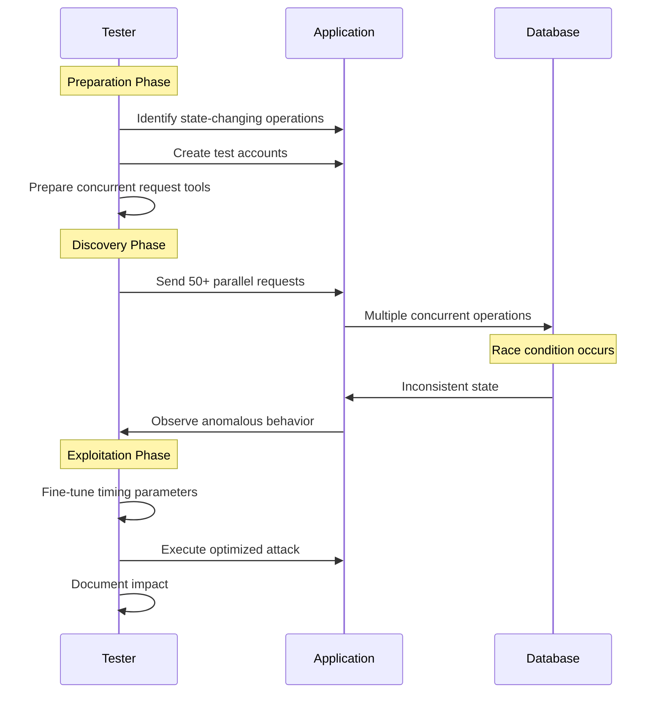

### Testing Strategies

#### Comprehensive Race Condition Test Methodology



1. **Preparation Phase**:
   - Map application functionality with state changes
   - Create multiple test accounts
   - Prepare parallel request tools and monitoring

2. **Discovery Phase**:
   - Test for TOCTOU issues in all critical functions
   - Test multi-step transactions with simultaneous final steps
   - Look for resource contention vulnerabilities
   - Test file operations for race conditions

3. **Exploitation Phase**:
   - Fine-tune timing and concurrency parameters
   - Create proof-of-concept exploits for confirmed issues
   - Measure impact with controlled exploitation
   - Document findings with clear reproduction steps

4. **Verification Phase**:
   - Test different concurrency levels (10, 50, 100 requests)
   - Vary timing patterns (synchronized vs staggered)
   - Test across different network conditions

### Real-World Testing Examples

#### E-commerce Application Testing

1. Add limited stock item to cart
2. Send 20 simultaneous checkout requests
3. Verify if multiple purchases succeed despite limited inventory

#### Banking Application Testing

1. Identify fund transfer functionality
2. Create 50 simultaneous transfer requests for the same amount
3. Verify account balance after transfers complete
4. Check for transaction logs inconsistencies

#### API Testing for Race Conditions

1. Identify stateful API endpoints
2. Create requests that modify shared resources
3. Execute requests simultaneously from multiple clients
4. Verify resource state consistency

## Advanced Race Condition Scenarios

### Multi-Endpoint Race Conditions

When functionality chains with multiple requests, for example in e-commerce:

```
- /product --> for the product
- /cart    --> Add to cart that product
- /cart/checkout  --> Buy that product
```

1. Send all required requests to Burp repeater in sequence
2. Create tabs for each request
3. Use "Send Parallel (single Packet Attack)" for execution

### Single-Endpoint Race Conditions

Common in email change functionality:

1. Setup:
   ```
   Account A: Attacker --> attacker@email.com
   Account B: Victim --> victim@email.com
   ```
2. When application updates email in database before confirmation
3. Send parallel requests changing email between attacker and victim addresses
4. If application generates confirmation links simultaneously, both may be sent to the same email
5. Impact: Potential for Account Takeover

## Remediation Recommendations

- **Transaction Isolation**: Implement proper database transaction isolation levels
- **Pessimistic Locking**: Lock resources before operations
- **Optimistic Concurrency Control**: Use version numbers or timestamps
- **Atomic Operations**: Use atomic operations where supported
- **Idempotent APIs**: Design APIs to be safely retried
- **Distributed Locks**: Implement distributed locking for microservices
- **Queue-Based Architecture**: Process requests sequentially through queues
- **Rate Limiting**: Enforce reasonable request rates per user
- **Stateful Synchronization**: Maintain consistent application state
- **Unique Constraint Enforcement**: Database-level constraint validation

### Connection Pool Exhaustion Races

Applications using connection pools (database, Redis, HTTP clients) can be vulnerable:

```python
# Test connection pool exhaustion
import requests
import threading

def hold_connection():
    # Keep connection open without releasing
    r = requests.get('https://target.com/long-running-query', stream=True)
    # Don't close, hold for 30 seconds
    time.sleep(30)

# Exhaust pool
threads = []
for _ in range(100):  # More than pool size
    t = threading.Thread(target=hold_connection)
    threads.append(t)
    t.start()

# Now test if race conditions occur in queue processing
```

**Testing Strategy:**

1. Identify endpoints that hold connections (long-running queries, file downloads)
2. Exhaust the pool with held connections
3. Test critical operations during exhaustion
4. Check if timeouts cause race conditions in cleanup logic

### CI/CD Pipeline Race Conditions

Deployment processes can have race conditions affecting security:

**Artifact Deployment Races:**

- Multiple pipelines deploying same artifact simultaneously
- Race between artifact upload and deployment
- Container image tag races (`latest` tag pointing to old image)

**Database Migration Races:**

```bash
# Two deployment instances running migrations simultaneously
# Test by triggering parallel deployments

# Check for migration locks
kubectl get pods -l job-name=db-migrate

# Test concurrent schema changes
```

**Configuration Deployment:**

- Race between config update and application reload
- Multiple instances reading stale configuration
- Secret rotation during active requests

**Testing Approach:**

1. Trigger multiple simultaneous deployments
2. Monitor for corrupted artifacts or partial deployments
3. Check database migration logs for conflicts
4. Verify configuration consistency across instances

## Real World Cases and CVEs

### Notable Race Condition Vulnerabilities

1. **CVE-2023-6690 - GitHub Enterprise Server**:
   - GraphQL mutation race condition
   - Low-privileged users could grant themselves site-admin privileges
   - Impact: Complete administrative takeover

2. **CVE-2021-41091 - Docker (Moby)**:
   - Race condition in permission check during container removal
   - Allowed non-root users to delete arbitrary files
   - Impact: Host system compromise

3. **CVE-2019-5736 - runc Container Escape**:
   - Race condition in container runtime
   - Attacker could overwrite host runc binary
   - Impact: Container escape to host

4. **CVE-2016-5195 - Dirty COW (Linux Kernel)**:
   - Race condition in memory management (Copy-on-Write)
   - Allowed privilege escalation to root
   - Impact: Complete system compromise

5. **PayPal - Double Payment Race Condition**:
   - Concurrent payment requests processed twice
   - User charged once but vendor paid twice
   - Impact: Financial loss

6. **Shopify - Gift Card Race Condition**:
   - Single-use gift cards redeemed multiple times
   - Race in balance check and deduction logic
   - Impact: Financial fraud

7. **Uber - Promotional Code Race**:
   - One-time promo codes used multiple times
   - Concurrent ride requests with same code
   - Impact: Revenue loss

### HackerOne Reports

1. **Flag Submission**: Race condition allowing multiple submissions of the same CTF flag, increasing user points unfairly
2. **Invite System**: Race condition allowing invitation of same member multiple times to a single team
3. **Retest Payment**: Race condition allowing multiple payments for a single retest
4. **Group Member Management**: Race condition preventing admin from removing group members
5. **User Following**: Race condition allowing multiple follows of the same user
6. **Report Voting**: Race condition enabling multiple upvotes/downvotes on a single report
7. **CTF Group Joining**: Race condition allowing multiple joins to the same CTF group
8. **Invitation Limit Bypass**: Race condition bypassing the invitation limit restriction
9. **Gift Card Redemption**: Race condition enabling multiple redemptions of the same gift card
10. **OAuth Token Generation**: Race during token generation allowed multiple valid tokens for single authorization code

### Impact Categories

- **Critical**: Financial loss, privilege escalation, data corruption
- **High**: Business logic bypass, resource exhaustion, unauthorized access
- **Medium**: Rate limit bypass, duplicate operations, inconsistent state
- **Low**: UI glitches, non-security-impacting inconsistencies

## Burp Suite Testing Methods

### Using Burp 2023.9.x or Higher

1. Send the request to repeater for multiple instances
2. Create tabs for all requests and select "Send Parallel (single Packet Attack)"
3. Execute and analyze results

### Using Turbo Intruder for Rate Limit Testing

```python
def queueRequests(target, wordlists):
    engine = RequestEngine(endpoint=target.endpoint,
                         concurrentConnections=1,
                         engine=Engine.BURP2)

    passwords = wordlists.clipboard

    for password in passwords:
        engine.queue(target.req, password, gate='1')

    engine.openGate('1')

def handleResponse(req, interesting):
    table.add(req)
```

---

## Attribution

Ported from [SnailSploit/Claude-Red](https://github.com/SnailSploit/Claude-Red)
(`Skills/*/offensive-race-condition`), Apache-2.0 licensed. Methodology preserved; Claude-specific
mechanics rewritten for OSA's builtin tools.

Part of the offensive skill library — see also `penetration-testing` for the
full-engagement workflow and `offensive-osint` / `osint-methodology` for
reconnaissance methodology.

## Tool status note

External CLI tools referenced above are classified at authoring time as `[LOCAL]`
(verified present), `[INSTALL]` (one-command install), or `[UPSTREAM-REF]`
(needs API keys or interactive use — methodology reference only). If you invoke a
tool and it is absent, check for an `[INSTALL]` note or fall back to the OSA
builtin tools; never fabricate tool output.
